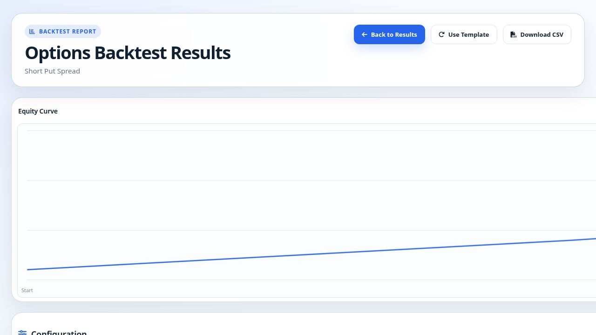
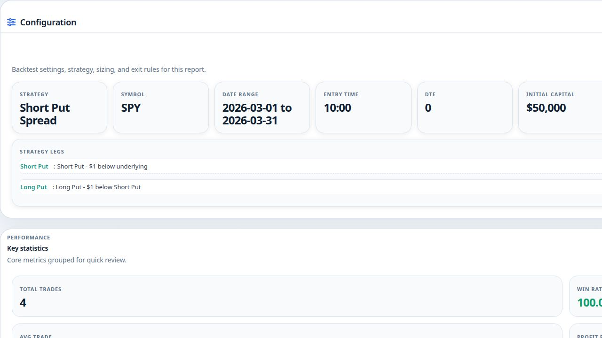
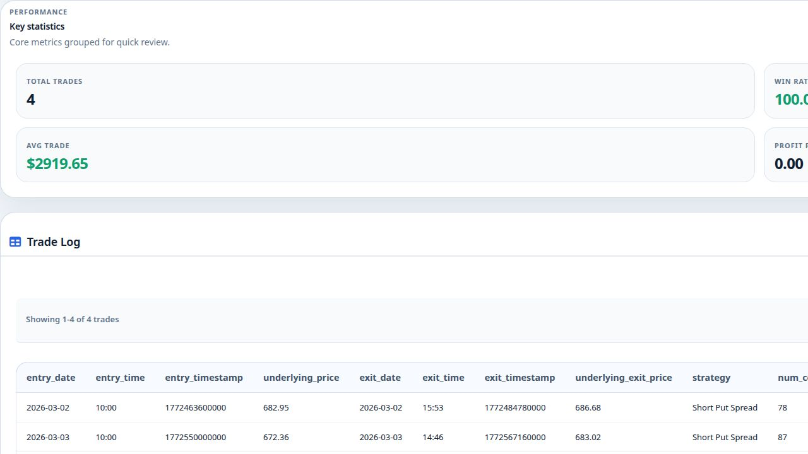
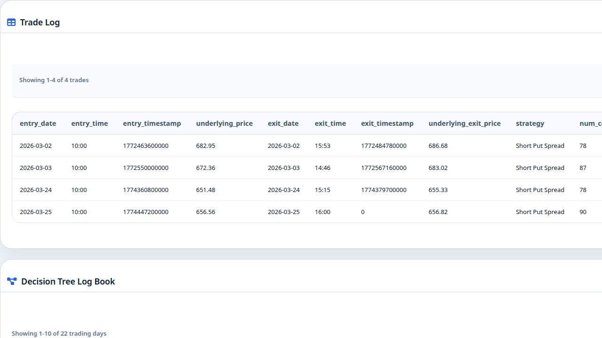
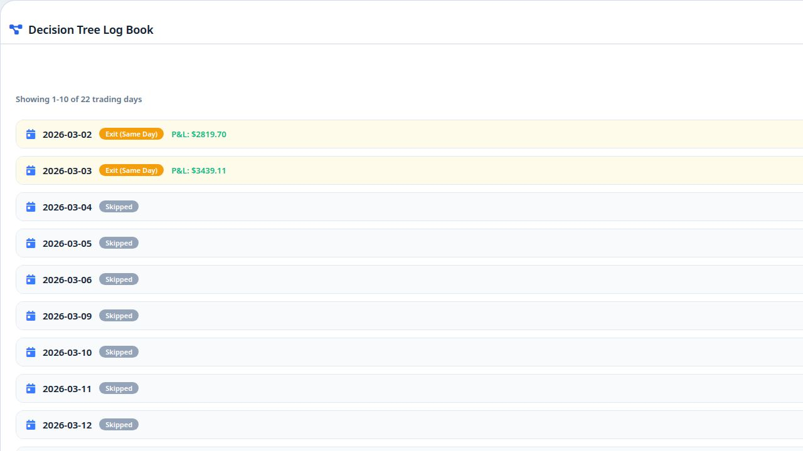

# Options Backtest Result Detail Page - Complete Reference

This document provides a comprehensive breakdown of every section on the Options Backtest Result Detail page, including visual references and detailed explanations of all data fields.

---

## Page Overview

The result detail page (`options-backtest-result-detail.html`) is a standalone report that displays the full output of a completed options backtest. It is accessed from the Options Results list by clicking "View" on any backtest card. The page loads the backtest metadata (configuration + summary), trade log CSV, and decision log to render five distinct sections.

**Screenshot: Header + Equity Curve**


---

## Section 1: Report Header

The header bar sits at the top of the page inside a frosted-glass card with rounded corners. It contains:

| Element | Description |
|---------|-------------|
| **Kicker Badge** | A small blue pill labeled "BACKTEST REPORT" to identify the page type. |
| **Title** | "Options Backtest Results" - the main page heading. |
| **Subtitle** | Displays the strategy name from the backtest config (e.g., "Short Put Spread"). |
| **Back to Results** | Blue primary button that navigates back to the Options Results list page. |
| **Use Template** | Secondary button (only shown if config exists) that saves the backtest configuration to session storage and redirects to the backtester form, pre-filling all settings so you can quickly re-run with tweaks. |
| **Download CSV** | Secondary button that downloads the complete trade log as a CSV file for external analysis (Excel, Google Sheets, Python, etc.). |

---

## Section 2: Equity Curve

**Screenshot: Equity Curve**


The equity curve is a line chart rendered with Chart.js that visualizes the cumulative profit and loss (P&L) over the sequence of trades.

### How It Works
- The X-axis represents each trade in sequence (labeled by exit date when available, otherwise "Trade 1", "Trade 2", etc.).
- The Y-axis (positioned on the right) shows the cumulative P&L in dollars, starting from $0.
- The line starts at the origin (0) and accumulates each trade's P&L to show the running total.

### Visual Indicators
- **Blue line**: Indicates the final cumulative P&L is positive (profitable backtest).
- **Red line**: Indicates the final cumulative P&L is negative (losing backtest).
- A prominent **zero line** is drawn across the chart to clearly separate profit territory from loss territory.
- A **summary chip** in the header shows the total trade count and final cumulative P&L (e.g., "4 trades | $11,678.61 cumulative P&L").

### Expand Button
- The expand icon (top-right of the equity section) opens a full-screen modal with a larger, more detailed version of the chart, including point markers, a legend, and axis titles.

### Interpretation
- An upward-trending line suggests the strategy is consistently profitable.
- A flat or choppy line suggests inconsistent returns.
- A downward-trending line indicates the strategy is losing money over time.
- Sharp drops indicate drawdown periods where significant losses occurred.

---

## Section 3: Configuration

**Screenshot: Configuration Section**


This collapsible section displays all the settings that were used to run this backtest. It is presented as a grid of labeled cards.

### Configuration Fields

| Field | Description |
|-------|-------------|
| **Strategy** | The options strategy type (e.g., Short Put Spread, Iron Condor, Long Call, Straddle, etc.). |
| **Symbol** | The underlying ticker symbol being traded (e.g., SPY, QQQ, AAPL). |
| **Date Range** | The start and end dates of the backtesting period (e.g., "2026-03-01 to 2026-03-31"). |
| **Entry Time** | The time of day when the backtester looks to enter trades (e.g., "10:00" for 10:00 AM ET). |
| **DTE** | Days to Expiration - the target number of days until the options contract expires. DTE 0 means same-day expiration (0DTE). |
| **Initial Capital** | The starting account balance for the backtest (e.g., $50,000). |
| **Position Sizing** | How much capital is allocated per trade. Either a percentage of capital (e.g., "Percentage: 10%") or a fixed dollar amount (e.g., "Dollar: $5,000"). |
| **Take Profit** | The profit target at which a position is automatically closed. Can be percentage-based (e.g., "100%" = double your premium) or dollar-based. |
| **Stop Loss** | The maximum acceptable loss at which a position is automatically closed. Can be percentage-based (e.g., "200%") or dollar-based. |
| **Premium Filter** | Min/max acceptable net premium range to filter out trades with premiums outside the desired range. |
| **Detection Interval** | How frequently (in minutes or seconds) the backtester checks market conditions during the trading day (e.g., "5 minutes"). |
| **Avoid PDT** | Whether the Pattern Day Trader rule is enforced (Yes/No). If Yes, limits day trades. |
| **Concurrent Trades** | Whether multiple positions can be open at the same time (Allowed/Not Allowed). |

### Strategy Legs Sub-Section
For multi-leg strategies, a detailed legs configuration panel appears showing each leg:
- **Leg Name** (e.g., "Short Put", "Long Put")
- **Position Type** (Long/Short)
- **Option Type** (Call/Put)
- **Strike Selection Method**: How the strike price is chosen:
  - **Delta**: Target delta value (e.g., 0.30)
  - **Dollar Underlying**: Dollar amount above/below the current underlying price (e.g., "$1 below underlying")
  - **Dollar Leg**: Dollar amount relative to another leg's strike (e.g., "$1 below Short Put")
  - **Percentage Underlying**: Percentage above/below underlying
  - **Mid Price**: ATM or specific premium range

---

## Section 4: Performance Statistics (Key Statistics)

**Screenshot: Performance Stats**


This section displays 8 core performance metrics in a 4x2 grid of stat pills.

### Metrics Breakdown

| Metric | Description | Color Coding |
|--------|-------------|--------------|
| **Total Trades** | The total number of trades executed during the backtest period. | Neutral (no color) |
| **Win Rate** | Percentage of trades that ended in profit. Calculated as (Winning Trades / Total Trades) x 100. | Green if >= 50% |
| **Total P&L** | The absolute dollar amount of total profit or loss across all trades combined. | Green if positive, Red if negative |
| **Return %** | The percentage return on the initial capital. Calculated as (Total P&L / Initial Capital) x 100. | Green if positive, Red if negative |
| **Avg Trade** | The average P&L per trade (accounts for both wins and losses). Calculated from the average win and average loss values. | Green if positive, Red if negative |
| **Profit Factor** | The ratio of gross profits to gross losses. A value > 1.0 means the strategy is profitable. A value of 0.00 means there were no losing trades (infinite profit factor, displayed as 0.00). | Neutral |
| **Max Drawdown** | The largest peak-to-trough decline in the equity curve, expressed as a percentage. Represents the worst-case loss from a high point. | Red if negative |
| **Final Capital** | The ending account balance after all trades. Equals Initial Capital + Total P&L. | Neutral |

### Interpretation Guide
- **Win Rate > 50%** combined with **Profit Factor > 1.0** indicates a fundamentally sound strategy.
- **Max Drawdown** is critical for risk management - a strategy with high returns but extreme drawdown may not be suitable for real trading.
- **Avg Trade** tells you the expected value per trade - even a high win rate can be unprofitable if average losses far exceed average wins.

---

## Section 5: Trade Log

**Screenshot: Trade Log**


The trade log is a paginated table (10 trades per page) that shows every individual trade executed during the backtest. This is the raw data underlying the equity curve and statistics.

### Trade Log Columns - Comprehensive Breakdown

The trade log CSV contains up to 39 columns for a two-leg strategy. Here is every column explained:

#### Entry Information

| Column | Description | Example |
|--------|-------------|---------|
| **entry_date** | The calendar date when the trade was opened. | 2026-03-02 |
| **entry_time** | The time of day when the trade was entered (ET). | 10:00 |
| **entry_timestamp** | Unix timestamp in milliseconds for the exact entry moment. Used for precise time calculations. | 1772463600000 |
| **underlying_price** | The price of the underlying asset (e.g., SPY) at the moment of trade entry. | 682.95 |

#### Exit Information

| Column | Description | Example |
|--------|-------------|---------|
| **exit_date** | The calendar date when the trade was closed. | 2026-03-02 |
| **exit_time** | The time of day when the trade was closed (ET). | 15:53 |
| **exit_timestamp** | Unix timestamp in milliseconds for the exact exit moment. | 1772484780000 |
| **underlying_exit_price** | The price of the underlying asset at the moment the trade was closed. Comparing this to `underlying_price` shows how much the stock moved during the trade. | 686.68 |

#### Trade Details

| Column | Description | Example |
|--------|-------------|---------|
| **strategy** | The options strategy used for this specific trade. | Short Put Spread |
| **num_contracts** | The number of option contracts traded. This is calculated based on position sizing (percentage or dollar allocation) and max risk per contract. | 78 |
| **net_premium_entry** | The net premium received (for credit strategies) or paid (for debit strategies) per contract at entry. Positive = credit received, Negative = debit paid. | 0.3615 |
| **net_premium_exit** | The net premium at exit. For profitable credit trades, this approaches 0 (options expired worthless or were bought back cheaply). | 0.0000 |
| **max_risk** | The maximum possible loss per contract for this trade. For spreads, this is the width of the strikes minus the net premium. | 0.64 |
| **pnl** | The total profit or loss for this trade in dollars. This is the key column - positive values are shown in green, negative in red. | 2819.70 |
| **exit_reason** | Why the trade was closed. Possible values: TAKE_PROFIT (profit target hit), STOP_LOSS (loss limit hit), EXPIRATION (options expired), EOD (end-of-day close). | TAKE_PROFIT |

#### Time Metrics

| Column | Description | Example |
|--------|-------------|---------|
| **dte** | Days to Expiration at the time the trade was entered. 0 = same-day expiration. | 0 |
| **dit** | Days in Trade - how long the position was held. For 0DTE trades, this is typically a fraction of a day (e.g., 0.2 = about 5 hours). | 0.2 |

#### Capital Tracking

| Column | Description | Example |
|--------|-------------|---------|
| **capital_before** | The account balance immediately before this trade was entered. | 50000.00 |
| **capital_after** | The account balance immediately after this trade was closed. Equals `capital_before + pnl`. | 52819.70 |

#### Leg-Specific Columns (repeated for each leg)

Each leg of the strategy gets its own set of columns. For a 2-leg strategy (e.g., Short Put Spread), you get `leg1_*` and `leg2_*` columns:

| Column | Description | Example |
|--------|-------------|---------|
| **leg1_symbol** | The full options contract symbol (OCC format). Encodes the underlying, expiration date, option type, and strike price. | O:SPY260302P00682000 |
| **leg1_name** | The human-readable name of this leg from your configuration. | Short Put |
| **leg1_strike** | The strike price of the option contract. | 682.00 |
| **leg1_entry_price** | The option premium at entry for this specific leg. | 1.9006 |
| **leg1_exit_price** | The option premium at exit for this specific leg. | 0.0100 |
| **leg1_iv** | The implied volatility of this option at entry. Higher IV means options are more expensive. | 0.3301 |
| **leg1_delta** | The option's delta at entry. Measures price sensitivity to $1 move in underlying. Negative for puts, positive for calls. | -0.4333 |
| **leg1_gamma** | The option's gamma at entry. Measures the rate of change of delta. Higher gamma means delta changes faster. | 0.066682 |
| **leg1_theta** | The option's theta at entry. Represents daily time decay in dollars. Negative values mean the option loses value each day (beneficial for sellers). | -4.6176 |
| **leg1_vega** | The option's vega at entry. Measures sensitivity to a 1% change in implied volatility. | 0.0703 |

The same columns repeat for **leg2_** (and potentially leg3_, leg4_ for strategies with more legs like Iron Condors or Iron Butterflies).

### P&L Color Coding
- **Green** text: Trade was profitable (P&L > 0)
- **Red** text: Trade was a loss (P&L < 0)

### Pagination
- Trades are displayed 10 per page
- Previous/Next buttons navigate between pages
- The header shows "Showing X-Y of Z trades"

---

## Section 6: Decision Tree Log Book

**Screenshot: Decision Tree**


The Decision Tree Log Book is a chronological, day-by-day record of what the backtester did on each trading day. It shows not only which trades were taken, but also WHY trades were skipped on certain days.

### Day-Level View
Each trading day in the backtest period appears as a collapsible row with:
- **Date**: The trading day (e.g., 2026-03-02)
- **Status Badge**: Color-coded label indicating what happened:
  - **Entry** (green): A new trade was opened
  - **Exit (Same Day)** (yellow): A trade was opened AND closed on the same day
  - **Skipped** (gray): No trade was taken this day
- **P&L** (if applicable): The profit or loss for trades that exited on this day

### Expanded Day Detail
Clicking on any day row expands it to show the full decision flow, which includes:

#### Context Information
- **Underlying Price**: The stock price at the time the backtester evaluated (e.g., "SPY: $682.95 @ 10:00")
- **Strategy**: The strategy being evaluated (e.g., "Short Put Spread")

#### Event Flow (Timeline)
The decision tree shows a vertical timeline of events for each day:

| Event Type | Icon | Description |
|------------|------|-------------|
| **NO DATA** | Database icon (gray) | No market data was available for this day (weekend, holiday, data gap). Reason provided. |
| **CONDITIONS NOT MET** | Ban icon (gray) | The entry conditions were checked but not satisfied. The reason explains why (e.g., "Entry conditions not met", "No valid options chain"). |
| **CONDITIONS MET** | Check circle (green) | The entry conditions were satisfied. Shows the price and time when conditions were met. |
| **TRADE SKIPPED** | Warning triangle (yellow) | Conditions were met but the trade could not be executed. Reasons include: insufficient capital, PDT restriction, concurrent trade limit, no valid options contracts found, premium outside filter range. |
| **ENTRY** | Sign-in icon (green) | A trade was successfully opened. Shows: number of contracts, net premium, max risk, expiration date, and individual leg details (position, type, strike, entry price). |
| **EXIT** | Sign-out/Shield/Target icon | A trade was closed. Shows: trade number, exit reason (Take Profit, Stop Loss, Expiration, End of Day), exit date/time, exit premium, and final P&L with color coding. |
| **ERROR** | Exclamation circle (red) | An error occurred during processing. Shows the error description. |

### Pagination
- Trading days are displayed 10 per page
- Previous/Next buttons navigate between pages
- Header shows "Showing X-Y of Z trading days"

### Why the Decision Tree Matters
The Decision Tree is one of the most valuable sections because it answers the question: **"What happened on the days you didn't trade?"** 

In any backtest, skipped days often outnumber traded days. Understanding WHY trades were skipped helps you:
1. **Validate your strategy logic** - Are entries being triggered at the right times?
2. **Identify data gaps** - Are there missing market data days affecting results?
3. **Tune entry conditions** - Are conditions too strict (too many skips) or too loose (too many entries)?
4. **Understand risk management** - Are PDT or concurrent trade rules blocking potentially profitable trades?
5. **Debug unexpected results** - If your backtest shows fewer trades than expected, the decision tree tells you exactly why.

---

## Data Flow Summary

```
Backtest Engine
    |
    v
metadata_{id}.json          --> Config + Summary + Decision Log
trade_log_{id}.csv          --> Individual trade records (39+ columns)
equity_curve_{id}.png       --> Pre-rendered chart (backup)
    |
    v
Result Detail Page
    |
    +-- Header (from metadata.config.strategy)
    +-- Equity Curve (built from trade log PnL column)
    +-- Configuration (from metadata.config)
    +-- Performance Stats (from metadata.summary)
    +-- Trade Log (from CSV file, paginated)
    +-- Decision Tree (from metadata.decision_log)
```
